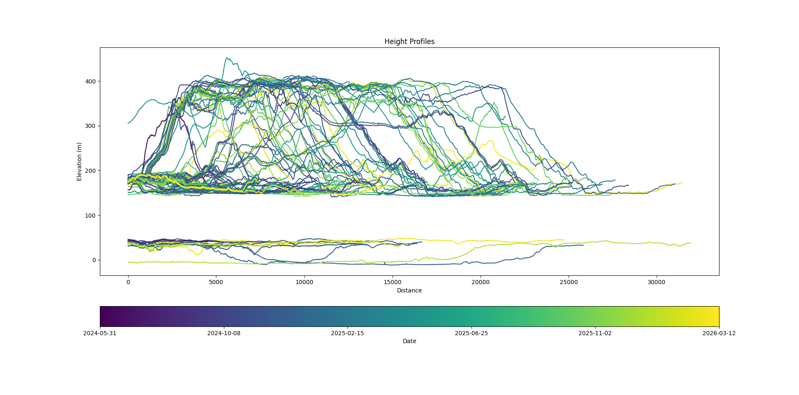
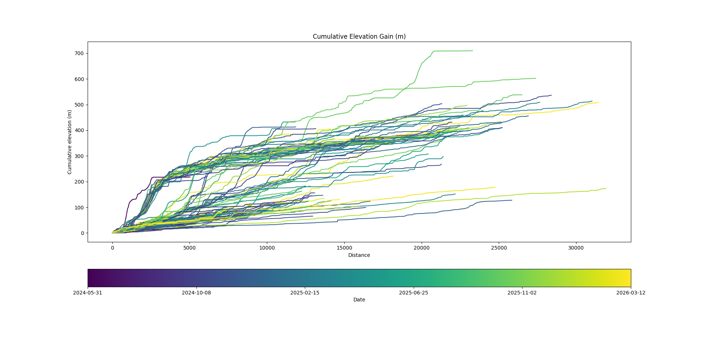
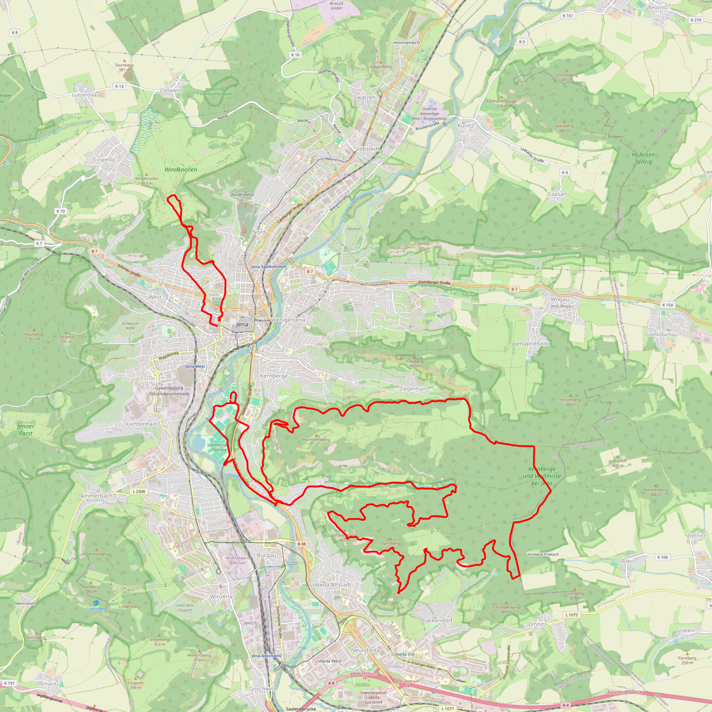

# Activity Visualizer

Some scripts for downloading, parsing and visualizing activity-data from a garmin account.
To create plots that aggregate data of multiple activities, to visualize training progress.

So far works only with a Garmin account.

## Contents
### Main Plotting Functionalities:
* `ActivityPlotter.py`: generates 2D-lineplots from activity data, for example an elevation profile (see above), pace profile or heartrate profile.

* `SplitPlotter.py`: generates scatterplots where each dot represents a split (of adjustable length). For example pace vs. heartrate, with elevation visualized by dot size.

* `RoutePlotter.py`: plots the gpx-data from activities on a map.

### Helper Functionalities:
* `DataHandler.py`: Handles loading the activity data from json-files.
* `OSMMapDownloader.py`: Handles fetching map data from openstreetmap.
* `GarminDataDownloader`: Handles fetching your Garmin activity data.

## Usage
Run main.py for an interactive UI.
Make sure to download data first, otherwise there is nothing to plot :)

Or run the scripts directly:
See examples in `ActivityPlotter.py`, `SplitPlotter.py` and `RoutePlotter.py`

## Requirements:
Python 3.10-ish
with additional packages:
* datetime
* numpy
* matplotlib
* argparse
* garminconnect
