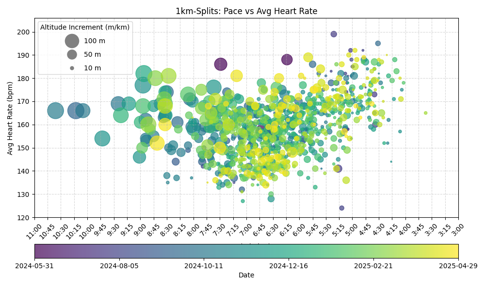

# Activity Visualizer

Some scripts for downloading, parsing and visualizing activity-data from a garmin account.
To create plots that aggregate data of multiple activities, to visualize training progress.

## Examples

